  

   

  
  
  
  

---

  <h2>Hero &amp; Profile</h2>
  

---

  <h2>About</h2>
  

---

  <h2>Skills</h2>
  

---

  <h2>Experience</h2>
  

---

  <h2>Projects</h2>
  

---

  <h2>Education</h2>
  

---

  <h2>Certifications</h2>
  

---

  <h2>Contact</h2>
  

---

  <h2>Live GitHub Analytics</h2>
  
   
  
  
   
  

---

  © 2026 Ankit Kumar • Full Stack Developer • Built with Passion & Precision

