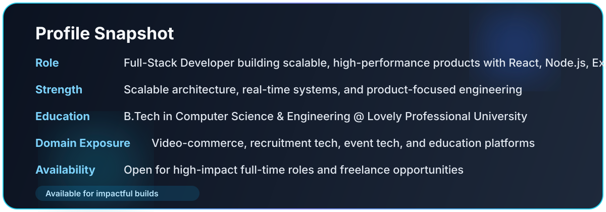
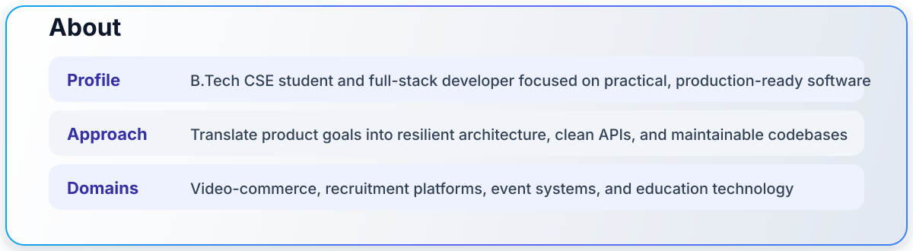
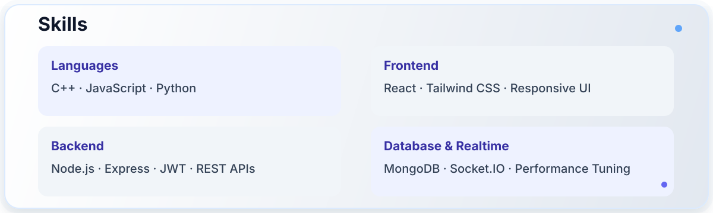
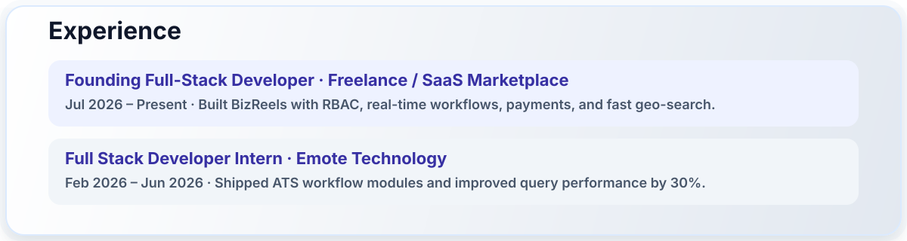
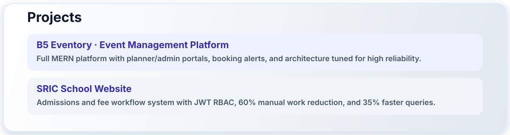
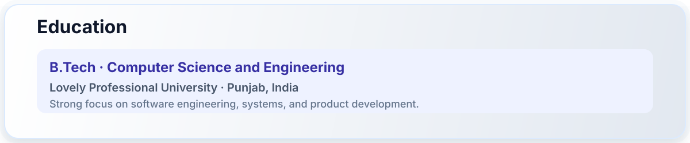
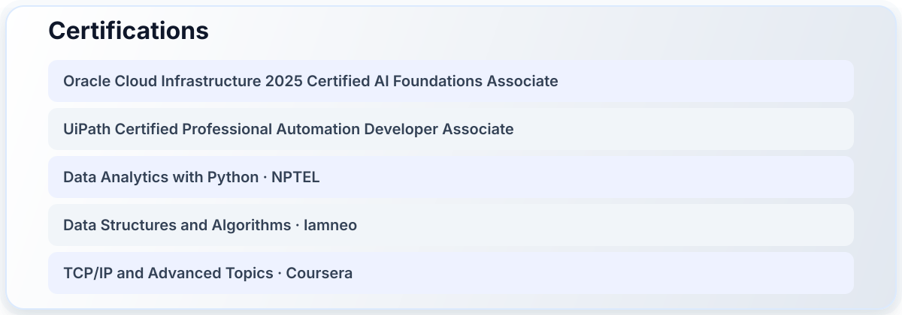
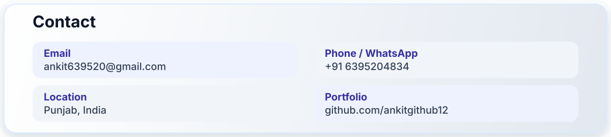

  

   

  
  
  
  

---

  
    
  

---

  
    
  

---

  
    
  

---

  
    
  

---

  
    
  

---

  
    
  

---

  
    
  

---

  
    
  

---

  
  
   
  

---

  © 2026 Ankit Kumar • Full Stack Developer • Built with Passion & Precision

